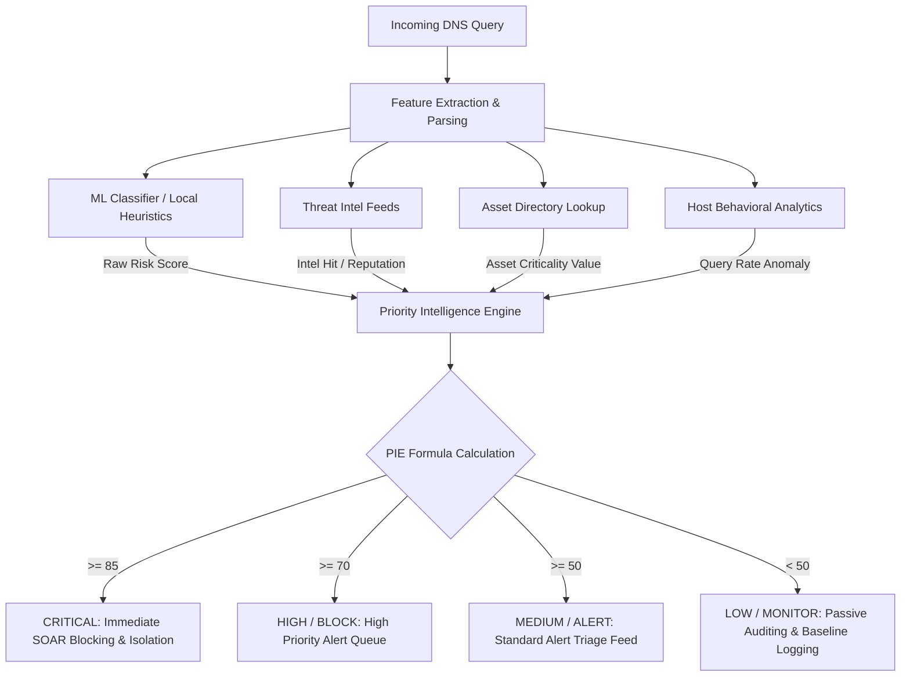

# Priority Intelligence Engine (PIE) Score

The **Priority Intelligence Engine (PIE)** is a core threat triage component of **DNSentinel**. Unlike static threat engines that only compute the probability of a domain being malicious, PIE is an **actionability and prioritization framework**. It translates raw detection probabilities (ML scores) along with threat intelligence feeds, behavioral analytics, asset criticality, and attack category tags into a single normalized **PIE Score (0–100)** and a matching SOC priority level.

---

## Table of Contents
1. [Core Philosophy](#core-philosophy)
2. [Mathematical Formulation](#mathematical-formulation)
3. [Input Vectors & Configurable Weights](#input-vectors--configurable-weights)
4. [Triage Priorities & Response Actions](#triage-priorities--response-actions)
5. [Contextual Explainability Engine](#contextual-explainability-engine)
6. [Dual-Tier Deployment Architecture](#dual-tier-deployment-architecture)
   - [Server-Side FastAPI Engine (`pie_engine.py`)](#1-server-side-fastapi-engine-pie_enginepy)
   - [Client-Side Chrome Extension (`heuristics.js`)](#2-client-side-chrome-extension-heuristicsjs)
7. [Why PIE Matters: Risk vs. Actionability](#why-pie-matters-risk-vs-actionability)

---

## Core Philosophy

In a high-throughput enterprise Security Operations Center (SOC), security analysts are plagued by alert fatigue. A raw Machine Learning model might flag a DNS query as having a `90%` probability of being a DGA domain. However:
- If that query originated from an isolated sandbox machine with an asset value of `10/100`, the priority is **low**.
- If that query originated from a domain-controller with an asset value of `100/100` and threat intelligence confirms active C2 beaconing on that domain, the priority is **CRITICAL**.

> [!IMPORTANT]
> **Risk Score $\neq$ SOC Priority.**
> *Risk* is the likelihood that a particular activity is malicious. *SOC Priority* is the urgency with which a security analyst must contain the host. PIE bridges this gap.



---

## Mathematical Formulation

The PIE Score is calculated as a bounded weighted sum of five key security dimensions. The result is strictly mapped to the interval $[0, 100]$.

$$\text{PIE Score} = \min\left(\max\left(\sum_{i=1}^{n} W_i \cdot S_i, \; 0\right), \; 100\right)$$

Where:
- $W_i$ represents the configurable weight of a dimension.
- $S_i$ represents the raw score of that dimension.

Expanding this to our five active system dimensions:

$$\text{PIE Score} = W_{\text{risk}} \cdot S_{\text{risk}} + W_{\text{intel}} \cdot S_{\text{intel}} + W_{\text{asset}} \cdot S_{\text{asset}} + W_{\text{behavior}} \cdot S_{\text{behavior}} + W_{\text{attack}} \cdot S_{\text{attack\_type}}$$

### Composite Incident Prioritization Index

For overall SIEM correlation and enterprise-wide composite risk grading, the system supports a classic three-factor threat exposure and triage rating equation:

$$\text{Composite Incident Rating} = (0.40 \cdot \text{Priority}) + (0.35 \cdot \text{Impact}) + (0.25 \cdot \text{Exploitability})$$

Where:
- **Priority**: The resolved PIE Priority Score ($0\text{ to } 100$) generated by the modular scoring engine.
- **Impact**: The potential operational and business disruption level ($0\text{ to } 100$) associated with targeted assets or compliance classifications (e.g., PCI-DSS or standard public networks).
- **Exploitability**: The ease/feasibility of attack replication ($0\text{ to } 100$), derived from threat intelligence vectors (e.g., presence of active wild exploits or known public CVE proof-of-concept scripts).

---

## Input Vectors & Configurable Weights

The engine utilizes the following weights (defined in [pie_engine.py](file:///c:/Users/Utkarsh%20Dubey/.gemini/antigravity/DNSentinel/backend/pie_engine.py)):

| Dimension Name | Constant / Config | Default Weight | Description |
| :--- | :---: | :---: | :--- |
| **Risk Score** ($S_{\text{risk}}$) | `risk_score` | **0.35** | Raw ML model prediction probability ($0 \text{ to } 100$). Measures statistical structural anomalies. |
| **Threat Intel** ($S_{\text{intel}}$) | `intel_score` | **0.25** | Reputation feed scoring (VirusTotal, AbuseIPDB) indicating known malicious signatures or IPs. |
| **Asset Value** ($S_{\text{asset}}$) | `asset_value` | **0.20** | Criticality index of the originating host ($0 \text{ to } 100$). Servers/Domain Controllers hold higher default values. |
| **Behavior Score** ($S_{\text{behavior}}$) | `behavior_score` | **0.10** | Statistical anomalies observed over a sliding time window (e.g., sudden burst in query rates). |
| **Attack Weight** ($S_{\text{attack\_type}}$) | `attack_weight` | **0.10** | Boost weight determined by the classified attack type. |

### Attack Type Severity Scale ($S_{\text{attack\_type}}$)

Different kinds of DNS threats present differing levels of impact. The engine dynamically maps the threat category output into a base score:

* **Exfiltration** ($90/100$): Highest severity. Indicates active, outbound intellectual property/data loss.
* **Tunneling** ($70/100$): High severity. Indicates bypass of security policy via DNS encapsulations (potential active remote C2 shell).
* **DGA (Domain Generation Algorithm)** ($40/100$): Medium severity. Suggests malware beaconing attempts.
* **Normal / Benign** ($0/100$): Standard, expected network behavior.

---

## Triage Priorities & Response Actions

Once the final score is calculated, it is mapped to a priority tier. Each tier triggers specific platform policies:

```
┌────────────────────────────────────────────────────────────────────────┐
│                                                                        │
│  [85 - 100]  CRITICAL  ──▶ Auto-Containment / SOAR Firewall Block│
│                                                                        │
│  [70 - 84]   HIGH      ──▶ Analyst Alert Feed + DNS Sinkholing      │
│                                                                        │
│  [50 - 69]   MEDIUM    ──▶ Triage Queue + SIEM Correlative Auditing │
│                                                                        │
│  [0 - 49]    LOW       ──▶ Passive Monitoring                       │
│                                                                        │
└────────────────────────────────────────────────────────────────────────┘
```

| Score Range | Priority Level | UI/Analyst Action | Automatic SOAR Playbook |
| :---: | :---: | :--- | :--- |
| **$\ge 85$** | **CRITICAL** | Red badge in Triage Feed. Immediate workstation popup. | **Auto-block** originating IP via generated firewall/sinkhole rules (24h auto-expiry). Restrict network egress. |
| **$70 \text{ to } 84$** | **HIGH** | Orange badge. Prioritized in analyst workbook. | **DNS Sinkholing** for the targeted domain (redirects to loopback `127.0.0.1`). |
| **$50 \text{ to } 69$** | **MEDIUM** | Yellow badge. Appears in standard SOC feed. | Queue for human-in-the-loop audit. Log parameters for ML retraining cycles. |
| **$< 50$** | **LOW / MONITOR** | Green badge. Filtered from primary triage list. | Allowed. Logged inside SQLite table (`dns_logs`) for baseline reference. |

---

## Contextual Explainability Engine

A crucial feature of PIE is its **human-readable explainability string**. SOC analysts must know *why* an alert was prioritized. The engine matches specific conditions to append descriptive context:

- **Criticality Trigger**: If the priority evaluates to `CRITICAL`, it adds `"Immediate containment required."`
- **Threat Intel Hit**: If the `intel_score > 80`, it appends `"Confirmed threat intelligence hit."`
- **Asset Criticality**: If the target host has `asset_value > 80`, it appends `"High-value asset target."`

### Example Explanations
* `"PIE Score 92.5 (CRITICAL). Immediate containment required. Confirmed threat intelligence hit. High-value asset target."`
* `"PIE Score 74.0 (HIGH). Confirmed threat intelligence hit."`
* `"PIE Score 24.5 (LOW)."`

---

## Dual-Tier Deployment Architecture

PIE is implemented in two distinct layers of the DNSentinel workspace, ensuring continuous security posture even when offline or operating in localized extension mode:

### 1. Server-Side FastAPI Engine (`pie_engine.py`)
Deployed in the python backend [pie_engine.py](file:///c:/Users/Utkarsh%20Dubey/.gemini/antigravity/DNSentinel/backend/pie_engine.py), it leverages Python classes to handle fully telemetry-backed computations:

```python
class PriorityIntelligenceEngine:
    def __init__(self):
        self.weights = {
            "risk_score": 0.35,
            "intel_score": 0.25,
            "asset_value": 0.20,
            "behavior_score": 0.10,
            "attack_weight": 0.10
        }
        self.attack_type_weights = {
            "DGA": 40,
            "tunneling": 70,
            "exfiltration": 90,
            "normal": 0
        }

    def calculate_priority(self, risk_score, intel_score=0, asset_value=50, behavior_score=0, attack_type="normal"):
        attack_weight = self.attack_type_weights.get(attack_type, 0)

        pie_score = (
            (self.weights["risk_score"] * risk_score) +
            (self.weights["intel_score"] * intel_score) +
            (self.weights["asset_value"] * asset_value) +
            (self.weights["behavior_score"] * behavior_score) +
            (self.weights["attack_weight"] * attack_weight)
        )

        pie_score = min(max(pie_score, 0), 100)

        if pie_score >= 85: priority = "CRITICAL"
        elif pie_score >= 70: priority = "HIGH"
        elif pie_score >= 50: priority = "MEDIUM"
        else: priority = "LOW"

        explanation = self._generate_explanation(pie_score, priority, intel_score, asset_value)
        return {
            "severity": risk_score,
            "priority_score": round(pie_score, 2),
            "priority": priority,
            "explanation": explanation
        }
```

### 2. Client-Side Chrome Extension (`heuristics.js`)
To provide the browser with an **instantaneous (<5ms) passive feedback loop**, a JavaScript version of PIE runs within the extension's service worker ([heuristics.js](file:///c:/Users/Utkarsh%20Dubey/.gemini/antigravity/DNSentinel/extension/background/heuristics.js)).

Because the extension does not have direct, latency-free access to back-end ML databases, it calculates a **heuristic risk score** using structural attributes of the query string:

1. **Shannon Entropy (48%)**: Measures domain randomisation/chaos (essential for detecting algorithmically generated strings).
2. **Length (20%)**: Penalises unusually long domains ($>20$ characters) which are typical in DNS Tunneling payload carriage.
3. **Digit Ratio (32%)**: Computes the frequency of numerical digits ($0\text{–}9$) across the query string.

```javascript
export function calculateFallbackScore(features, domain) {
    let risk_score = 0;

    // Heuristic Calculation
    risk_score += (features.entropy || 0) * 12;
    risk_score += ((features.length || 0) > 20 ? 20 : (features.length || 0));
    risk_score += ((features.digit_ratio || 0) * 35);
    risk_score = Math.min(risk_score, 100);

    // Simulating contextual variables locally
    const intel_score = Math.random() > 0.85 ? 90 : Math.random() * 30;
    const behavior_score = Math.random() * 40;
    const asset_value = 60; // Default workstation value

    let attack_weight = 0;
    if ((features.entropy || 0) > 4.2 || (features.length || 0) > 25) {
        attack_weight = 40; // Tagged DGA
    }

    const weights = { risk_score: 0.35, intel_score: 0.25, asset_value: 0.20, behavior_score: 0.10, attack_weight: 0.10 };

    let pie_score = (
        (weights.risk_score * risk_score) +
        (weights.intel_score * intel_score) +
        (weights.asset_value * asset_value) +
        (weights.behavior_score * behavior_score) +
        (weights.attack_weight * attack_weight)
    );
    pie_score = Math.min(Math.max(pie_score, 0), 100);

    let priority = "LOW";
    if (pie_score >= 85) priority = "CRITICAL";
    else if (pie_score >= 70) priority = "BLOCK";
    else if (pie_score >= 50) priority = "ALERT";
    else priority = "MONITOR";

    return {
        ml_score: pie_score / 100,
        final_score: pie_score,
        shap_reason: `PIE Engine: ${pie_score.toFixed(1)} (${priority}). Risk: ${risk_score.toFixed(1)}, Intel: ${intel_score.toFixed(1)}`
    };
}
```

---

## Why PIE Matters: Risk vs. Actionability

Traditional security systems present SOC teams with a flat list of anomaly probabilities. If a system gets 10,000 queries per second, a 0.1% false-positive rate produces **10 alerts per second**. By adjusting the classification logic through the **PIE scoring framework**, DNSentinel:
1. **Reduces Noise**: Demotes low-criticality assets even if the domain is slightly unusual.
2. **Speeds Up Mitigation**: Automatically initiates SOAR-triggered firewall blocks on critical hits without waiting for human confirmation.
3. **Improves Analyst Trust**: Provides transparent, deterministic logic showing precisely how the priority score was derived.
